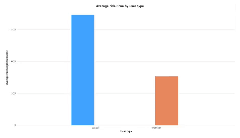

<!-- PROJECT SHIELDS -->
[![Contributors][contributors-shield]][contributors-url]
[![Forks][forks-shield]][forks-url]
[![Stargazers][stars-shield]][stars-url]
[![Issues][issues-shield]][issues-url]
[![MIT License][license-shield]][license-url]
[![LinkedIn][linkedin-shield]][linkedin-url]

<!-- PROJECT LOGO -->
 

  

<h3 align="center">Analyze bike usage of Cyclistic</h3>

  

    Finding insights to improve marketing campaign which attracts casuals switch to members more
     
    <a href="https://github.com/NguyenN95/Cyclistic-Analysis#about-the-project"><strong>Explore the docs »</strong></a>
     
     
    <a href="https://github.com/NguyenN95/Cyclistic-Analysis/blob/main/script.sql">View SQL script</a>
     
     
    <a href="https://drive.google.com/file/d/1-QNdF5aBtwqJsOPcQxwb6e3S27pImEuf/view">Download Excel analysis (05/2023)</a>
    ·
    <a href="https://drive.google.com/file/d/1-TatybsDLky1I9-46Xt61a5RX6BA0l3W/view">Download Power BI file</a>
     
     
    <a href="https://www.kaggle.com/datasets/nguyenn95/062022-052023-cyclistic-trip-data">View Dataset</a>
    .
    <a href="https://www.kaggle.com/nguyenn95/cyclistic-analysis-using-r">View R Notebook</a>
    .
    <a href="https://www.kaggle.com/code/nguyenn95/cyclistic-analystic-using-python">View Python Notebook</a>
    .
    <a href="https://public.tableau.com/app/profile/nguyen.nguyen6937/viz/CyclisticAnalysis_16918599784790/Ridetimedistributionnormalorskew">View Tableau Dashboard</a>
  

<!-- TABLE OF CONTENTS -->

  
Table of Contents

  <ol>
    <li>
      <a href="#about-the-project">About The Project</a>
      <ul>
        <li><a href="#built-with">Built With</a></li>
      </ul>
    </li>
    <li>
      <a href="#getting-started">Getting Started</a>
      <ul>
        <li><a href="#prerequisites">Prerequisites</a></li>
        <li><a href="#installation">Installation</a></li>
      </ul>
    </li>
    <li><a href="#contributing">Contributing</a></li>
    <li><a href="#license">License</a></li>
    <li><a href="#contact">Contact</a></li>
    <li><a href="#acknowledgments">Acknowledgments</a></li>
  </ol>

<!-- ABOUT THE PROJECT -->
## About The Project

I am a *junior data analyst* working in the marketing analyst team at ***Cyclistic***, a bike-share company in ***Chicago***. The director of marketing believes the company’s future success depends on maximizing the number of annual memberships. Therefore, your team wants to understand *how casual riders and annual members use Cyclistic bikes differently*. From these insights, your team will design a new marketing strategy to convert casual riders into annual members. But first, Cyclistic executives must approve your recommendations, so they must be backed up with compelling data insights and professional data visualizations.

**Three questions** will guide the future marketing program:
1. How do annual members and casual riders use Cyclistic bikes differently?
2. Why would casual riders buy Cyclistic annual memberships?
3. How can Cyclistic use digital media to influence casual riders to become members?

**Moreno** - *The director of marketing and your manager*, has assigned me the first question to answer: 
> **How do annual members and casual riders use Cyclistic bikes
differently?**

(<a href="#readme-top">back to top</a>)

### Built With

* [![R][R]][R-url]
* [![Microsoft Excel][Microsoft Excel]][Microsoft-Excel-url]
* [![Power Bi][Power Bi]][Power-Bi-url]
* [![Postgres][Postgres]][Postgres-url]
* [![Kaggle][Kaggle]][Kaggle-url]

(<a href="#readme-top">back to top</a>)

<!-- GETTING STARTED -->
## Getting Started

These instructions below are meant to be for reproducing running application on your machine.

### Prerequisites

* [Download Microsoft Excel][Microsoft-Excel-url]
* [Download Power BI](https://go.microsoft.com/fwlink/?LinkId=2240819&clcid=0x409)
* [Download Postgres](https://www.postgresql.org/download/)
* [Download R Studio](https://posit.co/download/rstudio-desktop/)
* [Download Valentino Studio (latest)][Valentino-download-url] (**Optional**)

### Installation

* [How to install **Microsoft Excel**](https://support.microsoft.com/en-us/office/download-and-install-or-reinstall-microsoft-365-or-office-2021-on-a-pc-or-mac-4414eaaf-0478-48be-9c42-23adc4716658) 
* [How to install **Power BI**](https://learn.microsoft.com/en-us/power-bi/fundamentals/desktop-get-the-desktop)
* [How to install **Postgre**](https://www.postgresqltutorial.com/postgresql-getting-started/install-postgresql/)
* [How to install **Valentino studio**](https://valentina-db.com/docs/dokuwiki/v12/doku.php?id=valentina:products:vstudio:manual:installation) (**Optional**)

(<a href="#readme-top">back to top</a>)

<!-- CONTRIBUTING -->
## Contributing

Contributions are what make the open source community such an amazing place to learn, inspire, and create. Any contributions you make are **greatly appreciated**.

If you have a suggestion that would make this better, please fork the repo and create a pull request. You can also simply open an issue with the tag "enhancement".
Don't forget to give the project a star! Thanks again!

1. Fork the Project
2. Create your Feature Branch (`git checkout -b feature/AmazingFeature`)
3. Commit your Changes (`git commit -m 'Add some AmazingFeature'`)
4. Push to the Branch (`git push origin feature/AmazingFeature`)
5. Open a Pull Request

(<a href="#readme-top">back to top</a>)

<!-- LICENSE -->
## License

Distributed under the MIT License. See `LICENSE.txt` for more information.

(<a href="#readme-top">back to top</a>)

<!-- CONTACT -->
## Contact

Nguyen - [@linkedin][linkedin-url] - nguyennguyen7595@gmail.com

Project Link: [https://github.com/NguyenN95/Cyclistic-Analysis](https://github.com/NguyenN95/Cyclistic-Analysis)

(<a href="#readme-top">back to top</a>)

<!-- ACKNOWLEDGMENTS -->
## Acknowledgments

**Course**

* [Google Data Analytics Professional Certificate](https://www.coursera.org/professional-certificates/google-data-analytics)

**Dataset**

* [06/2022 - 05/2023 trip data](https://www.kaggle.com/datasets/nguyenn95/062022-052023-cyclistic-trip-data)
* [Original dataset](https://divvy-tripdata.s3.amazonaws.com/index.html)

**README.md Template**

* [Best-README-Template](https://github.com/othneildrew/Best-README-Template)

**Markdown + Shields.io + Emoji**

* [How to make custom language badges for your profile using shields.io](https://javascript.plainenglish.io/how-to-make-custom-language-badges-for-your-profile-using-shields-io-d2aeaf016b6b)
* [Markdown-badges](https://github.com/Ileriayo/markdown-badges)
* [Emoji Cheat Sheet](https://www.webfx.com/tools/emoji-cheat-sheet/)

**VS Code Extension**

* [Markdown All in One](https://marketplace.visualstudio.com/items?itemName=yzhang.markdown-all-in-one)

(<a href="#readme-top">back to top</a>)

<!-- MARKDOWN LINKS & IMAGES -->
<!-- https://www.markdownguide.org/basic-syntax/#reference-style-links -->
[contributors-shield]: https://img.shields.io/github/contributors/NguyenN95/Cyclistic-Analysis.svg?style=for-the-badge
[contributors-url]: https://github.com/NguyenN95/Cyclistic-Analysis/graphs/contributors

[forks-shield]: https://img.shields.io/github/forks/NguyenN95/Cyclistic-Analysis.svg?style=for-the-badge
[forks-url]: https://github.com/NguyenN95/Cyclistic-Analysis/network/members

[stars-shield]: https://img.shields.io/github/stars/NguyenN95/Cyclistic-Analysis.svg?style=for-the-badge
[stars-url]: https://github.com/NguyenN95/Cyclistic-Analysis/stargazers

[issues-shield]: https://img.shields.io/github/issues/NguyenN95/Cyclistic-Analysis.svg?style=for-the-badge
[issues-url]: https://github.com/NguyenN95/Cyclistic-Analysis/issues

[license-shield]: https://img.shields.io/github/license/NguyenN95/Cyclistic-Analysis.svg?style=for-the-badge
[license-url]: https://github.com/NguyenN95/Cyclistic-Analysis/blob/master/LICENSE.txt

[linkedin-shield]: https://img.shields.io/badge/-LinkedIn-black.svg?style=for-the-badge&logo=linkedin&colorB=555
[linkedin-url]: https://linkedin.com/in/nguyenn95

[product-screenshot]: images/screenshot.png

[R]: https://img.shields.io/badge/r-%23276DC3.svg?style=for-the-badge&logo=r&logoColor=white
[R-url]: https://www.r-project.org/

[Microsoft Excel]: https://img.shields.io/badge/Microsoft_Excel-217346?style=for-the-badge&logo=microsoft-excel&logoColor=white
[Microsoft-Excel-url]: https://www.microsoft.com/en-us/microsoft-365/excel

[Power Bi]: https://img.shields.io/badge/power_bi-F2C811?style=for-the-badge&logo=powerbi&logoColor=black
[Power-Bi-url]: https://powerbi.microsoft.com/en-us/

[Postgres]: https://img.shields.io/badge/postgres-%23316192.svg?style=for-the-badge&logo=postgresql&logoColor=white
[Postgres-url]: https://www.postgresql.org/

[Kaggle]: https://img.shields.io/badge/Kaggle-035a7d?style=for-the-badge&logo=kaggle&logoColor=white
[Kaggle-url]: https://www.kaggle.com/

[Valentino-download-url]: https://valentina-db.com/en/studio/download
